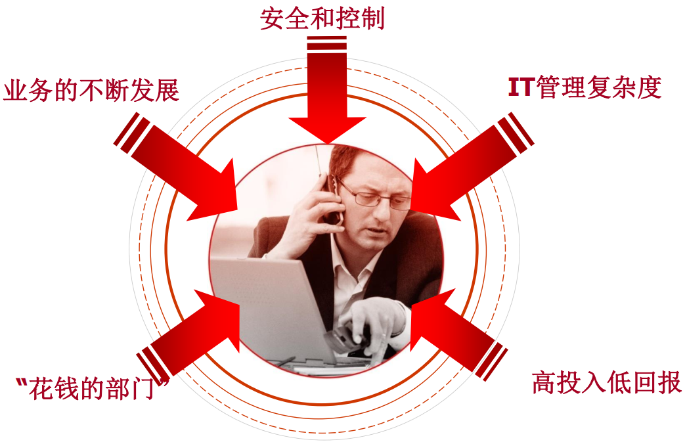

### 0x00  ITSM概述

 - 学习收益
   - 掌握ITIL 4的前置知识
   - 掌握服务管理的关键概念
   - 理解服务管理的四个维度
   - 理解ITIL服务价值系统
   - 掌握核心的管理实践
   - 了解一般的管理实践

- 目标受众
  - CIO，IT经理/主管，运维支持人员，流程负责人.....
    - 想系统了解ITIL
    - 想获得ITIL认证
    - 想通过ITIL提升IT服务管理水平
    - 想学习IT服务管理的流行语言

#### 0x00.0 ITIL 4的前置知识

##### 0x00.0.0 日益复杂的IT管理

- 业务的不断发展：
- 安全和控制：不仅要保障业务能跑起来，还要正常的运行
- IT管理复杂度：例如手机的应用，医院HIS系统，比前些年更加复杂
- 高投入低回报：通过IT获得回报的认可度不是很高
- "花钱的部门“：

##### 0x00.0.1 IT运维管理面临的挑战

- **规模大、管理复杂**
  - 应用越来越多，管理复杂度越来越高
- **安全问题突出，合规审计要求高**
  - 安全问题层出不穷，互联网应用导致安全事件越来越多，数据丢失、人员离职等等导致很多问题
  - 保证IT运维在规范下来进行的，运维的记录要经得起审计
- **工作绩效难以考核**
  - IT部门主管衡量IT部门工程师支持工作量的时候很难考核，看工作时间？解决问题的数量？客户满意度？==》很难考核
- **业务对IT提出高要求，而IT回报无法量化**
  - IT都是为业务提供服务的，“IT战略要服务于企业的业务战略”，IT以业务为核心，7*24小时不能出问题
  - 双十一，每年都有大幅提升，基础平台是IT。每年提升额度有多少能划到IT名下呢？很难去说，但是如果没有IT支撑是无法提升上来的，IT付出的回报是无法量化的
- **信息中心职能定位落后，领导的重视不够**
  - 很多公司有信息中心、网络中心、信息管理部门或者科技部等等，定位却是一个修电脑的（除了金融领域IT部门地位最高）
  - 领导认为IT部门不能直接创造价值，导致重视不够
- **面对多个供应商，缺乏管理框架进行服务集成**
  - 一家公司用了多少IT供应商的产品（软件、硬件、网络设备等等），统一集成来管理，却没有统一管理的框架。
- **缺乏系统的管理规范，摸着石头过河**

##### 0x00.0.2 许多IT部门面临如下问题

- IT为业务部门做了什么？
  - 高成本与低质量.......
  - 有限的IT资源，包括人员，系统等，人手永远不够。
  - 用户的不合理期望和需求，如何解决？
  - 外包混乱，如何管理外包服务？

- 影响？......
- IT's没有得到正确评价，用户不满意......
  - 是否是IT的错？

##### 0x00.0.3 IT工程师及管理者面临的困惑

- **IT工程师的困惑**  
  - 简单重复性问题比例较高
  - 忙于救火，并且陷入恶性循环，用心却做了错事
  - 经常加班，任务繁重
  - 业绩无法明确考核，得不到领导的认可且缺乏成就感
  - 得不到业务部门的认可和尊重，职业前景不明朗
- **IT管理者的困惑**  
  - IT服务部门该如何进行定位？价值如何体现？
    - 服务部门、支持部门、引领部门、监管部门、制定规则的部门？需要管理者去思考
    - 解决的问题？创造的价值？
  - 考核没有“抓手”，如何真正调动团队积极性？
  - 过分依赖核心技术人员，人才流动性风险较高。
    - IT毕竟是技术性很强的工作，很多工作需要依赖技术性很强的人员的技术能力，如果一个公司过分依赖一个人员，那么就存在人员风险了，也就是管理出现问题了，没有实现流程化管理
    - IT人员流动性很大
  - IT部门自身管理信息化程度不高，管理方式落后
    - 为自己上一个系统
  - 领导只看“功劳”不看“苦劳”？
  - 如何应对组织规模扩张对IT服务管理带来的挑战？
    - 现在组织规模扩张是比较频繁的
    - 很多是分公司的IT是由总公司来支持的
    - 如何用最小的人力资源成本带动最大的效益？
  - 客户是上帝，上帝是否需要遵守流程规范？
  - 如何降低整体IT服务成本？
    - 作为管理者最想用最少的钱办最多的事

##### 0x00.0.4 问题的核心所在

- ** 调查发现（一）：导致服务器、网络和应用出现故障的十大原因：**
  - 病毒攻击（57.1%）
  -  缺乏有效的监控制度和手段（51.7%）
  - IT设备本身的性能问题（41.1%）
  - 应用系统/数据库本身存在Bugs（39.2%）
  - 员工缺少技能培训（37.5%）
  - 维护不及时或缺乏有计划的维护（35.7%）
  - 缺少总体规划/重复建设（33.9%）
  - 不同部门的IT人员之间缺乏协调（32.1%）
  - 缺少运营管理方法论的指导（30.4%）
  - 员工不按规定/流程操作（28.6%）

- **调查发现（二） ：减少基础设施故障最有效的措施：**  
  - 推行流程管理（60.7%）
  - 实行统一的安全管理与控制（53.6%）
  - 争取公司高层领导的重视和支持（51.8%）
  - 对员工进行有针对性的培训（51.8%）
  - 定期分析系统和网络的性能（51.8%）
  - 进行集中式管理（48.2%）
  - 进行冗余备份和灾备（33.9%）
  - 加强对用户的培训和教育（32.1%）
  - 设立统一的IT支持前台（35.7%）
  - 使用网络、系统或数据库监控系统（30.4%）

#### 0x00.1 ITIL 4介绍

#### 0x00.2 服务管理的关键概念

#### 0x00.3 服务管理的四个维度

#### 0x00.4 ITIL服务价值系统（SVS） 

### 0x01  ITIL管理实践之普通管理实践

### 0x02 ITL管理实践之服务管理实践

### 0x03 ITIL管理实践之技术管理实践

